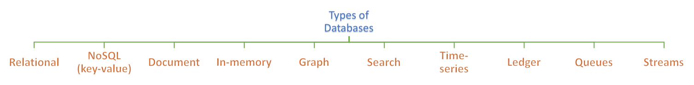

================
Database Journal
================

This repository is a collection of all-things database. It includes some fundamental concepts of databases, code samples, interview questions and more.

Index:

* `Database commands <https://github.com/hardikvasa/database-journal#database-commands>`__ 
* `Code Samples <https://github.com/hardikvasa/database-journal#code-samples>`__ 
* `Selecting the right database <https://github.com/hardikvasa/database-journal#dbms-comparison-chart>`__ 
* `Interview Questions <interview-questions/README.rst>`__ 

Database commands
=================

+---------------+------------+---------------------------------------+---------+-----------------------------------------------------------------------------------------------------+
| DBMS          | Model      | Description                           | Runtime | Link                                                                                                | 
+===============+============+=======================================+=========+=====================================================================================================+
| MySQL         | Relational | Mysql basic commands                  | Shell   | `link <database-commands/mysql_commands.rst>`__                                                     |
+---------------+------------+---------------------------------------+---------+-----------------------------------------------------------------------------------------------------+
| MongoDB       | Document   | MongoDB basic commands                | Shell   | `link <database-commands/mongodb.rst>`__                                                            |
+---------------+------------+---------------------------------------+---------+-----------------------------------------------------------------------------------------------------+

Code Samples
============

This section contains sample codes for database operations. For python, there are several options like `mysql-connector`, `pymysql`, `MySQLdb`, `SqlAlchemy`, etc.

+---------------+------------+---------------------------------------+---------+-----------------------------------------------------------------------------------------------------+---------------------------------------------------------------------------------------------------------+
| DBMS          | Model      | Description                           | Runtime | Sample Code                                                                                         | Docs                                                                                                    |
+===============+============+=======================================+=========+=====================================================================================================+=========================================================================================================+
| MySQL         | Relational | Python mysql connector code sample    | Python  | `link <code-samples/mysql_connector_sample.py>`__                                                   | `docs <https://dev.mysql.com/doc/>`__                                                                   |
+---------------+------------+---------------------------------------+---------+-----------------------------------------------------------------------------------------------------+---------------------------------------------------------------------------------------------------------+
| MySQL         | Relational | PyMySQL code sample                   | Python  | `link <code-samples/pymysql_sample.py>`__                                                           | `docs <https://dev.mysql.com/doc/>`__                                                                   |
+---------------+------------+---------------------------------------+---------+-----------------------------------------------------------------------------------------------------+---------------------------------------------------------------------------------------------------------+
| PostgreSQL    | Relational | PostgreSQL using psycopg2 code sample | Python  | `link <code-samples/postgresql.py>`__                                                               | `docs <https://www.postgresql.org/docs/>`__                                                             |
+---------------+------------+---------------------------------------+---------+-----------------------------------------------------------------------------------------------------+---------------------------------------------------------------------------------------------------------+
| MongoDB       | Document   | MongoDB NoSQL database code sample    | Python  | `link <code-samples/mongo.py>`__                                                                    | `docs <https://docs.mongodb.com/>`__                                                                    |
+---------------+------------+---------------------------------------+---------+-----------------------------------------------------------------------------------------------------+---------------------------------------------------------------------------------------------------------+
| SQS           | Queue      | AWS Simple Queue Service operations   | Python  | `link <code-samples/sqs.py>`__                                                                      | `docs <https://docs.aws.amazon.com/sqs/index.html>`__                                                   |
+---------------+------------+---------------------------------------+---------+-----------------------------------------------------------------------------------------------------+---------------------------------------------------------------------------------------------------------+
| ActiveMQ      | Queue      | MQ Producer and MQ Consumer           | Python  | `link <code-samples/mq_producer.py>`_, `link <code-samples/mq_consumer.py>`_                        | `docs <https://activemq.apache.org/getting-started.html>`__                                             |
+---------------+------------+---------------------------------------+---------+-----------------------------------------------------------------------------------------------------+---------------------------------------------------------------------------------------------------------+
| ActiveMQ      | Queue      | MQ Producer and MQ Consumer           | Java    | `link <code-samples/MQProducer.java>`_, `link <code-samples/MQConsumer.java>`_                      | `docs <https://activemq.apache.org/getting-started.html>`__                                             |
+---------------+------------+---------------------------------------+---------+-----------------------------------------------------------------------------------------------------+---------------------------------------------------------------------------------------------------------+
| OracleDB      | Relational | OracleDB sample code                  | Python  | `link <code-samples/oracledb.py>`_                                                                  | `docs <https://cx-oracle.readthedocs.io/en/latest/index.html>`__                                        |
+---------------+------------+---------------------------------------+---------+-----------------------------------------------------------------------------------------------------+---------------------------------------------------------------------------------------------------------+
| Kinesis       | Stream     | AWS Kinesis stream sample code.       | Python  | `link <code-samples/kinesis_producer.py>`_, `link <code-samples/kinesis_consumer.py>`_              | `docs <https://docs.aws.amazon.com/streams/latest/dev/introduction.html>`__                             |
+---------------+------------+---------------------------------------+---------+-----------------------------------------------------------------------------------------------------+---------------------------------------------------------------------------------------------------------+
| Redis         | In-memory  | Redis code sample in python.          | Python  | `link <code-samples/redis_python.py>`_                                                              | `docs <https://redis.io/documentation>`__                                                               |
+---------------+------------+---------------------------------------+---------+-----------------------------------------------------------------------------------------------------+---------------------------------------------------------------------------------------------------------+
| Neo4j         | Graph      | Graph database using neo4j-driver     | Python  | `link <code-samples/neo4j_sample.py>`_                                                              | `docs <https://neo4j.com/docs/>`__                                                                      |
+---------------+------------+---------------------------------------+---------+-----------------------------------------------------------------------------------------------------+---------------------------------------------------------------------------------------------------------+
| DynamoDB      | Document   | DynamoDB basic operations             | Python  | `link <code-samples/dynamodb.py>`_                                                                  | `docs <https://docs.aws.amazon.com/dynamodb/index.html>`__                                              |
+---------------+------------+---------------------------------------+---------+-----------------------------------------------------------------------------------------------------+---------------------------------------------------------------------------------------------------------+
| ElasticSearch | Search     | ElasticSearch basic operations        | Python  | `link <code-samples/elasticsearch_sample.py>`_                                                      | `docs <https://www.elastic.co/guide/index.html>`__                                                      |
+---------------+------------+---------------------------------------+---------+-----------------------------------------------------------------------------------------------------+---------------------------------------------------------------------------------------------------------+
| AWS Neptune   | Graph      | Connecting to AWS Neptune with Gremlin| Python  | `link <code-samples/aws_neptune.py>`_                                                               | `docs <http://tinkerpop.apache.org/docs/current/reference/>`__                                          |
+---------------+------------+---------------------------------------+---------+-----------------------------------------------------------------------------------------------------+---------------------------------------------------------------------------------------------------------+
| Cassandra     | Wide-column| Cassandra basic operations            | Python  | `link <code-samples/cassandra_sample.py>`_                                                          | `docs <http://cassandra.apache.org/doc/latest/>`__                                                      |         
+---------------+------------+---------------------------------------+---------+-----------------------------------------------------------------------------------------------------+---------------------------------------------------------------------------------------------------------+
| Amazon Aurora | MySQL      | Basic Operations for Aurora DB        | Python  | `link <code-samples/aurora.py>`_                                                                    | `docs <https://docs.aws.amazon.com/AmazonRDS/latest/AuroraUserGuide/CHAP_AuroraOverview.html>`__        |         
+---------------+------------+---------------------------------------+---------+-----------------------------------------------------------------------------------------------------+---------------------------------------------------------------------------------------------------------+

DBMS comparison chart
=====================

This section some characteristics and comparison points between different database technologies.

+-----------------+--------------------+---------------------+---------------------+------------------+---------------+-----------------+--------------------+----------------+-------------------+---------------------------+
| Property        | Relational DB      | NoSQL DB            | Document DB         | In-memory DB     | Graph DB      | Search DB       | Time-series DB     | Ledger DB      | Queues            | Streams                   |
+=================+====================+=====================+=====================+==================+===============+=================+====================+================+===================+===========================+
| Type            | Relational         | Non-Relational      | Non-Relational      | Non-Relational   | Relational    | Non-Relational  | Relational         | Non-Relational | Non-Relational    | Non-Relational            |
+-----------------+--------------------+---------------------+---------------------+------------------+---------------+-----------------+--------------------+----------------+-------------------+---------------------------+
| Data            | Structured         | Un-structured       | Un-structured       | Un-structured    | Un-structured | Semi-structured | Structured         | Chain          | Un-structured     | Un-structured             |
+-----------------+--------------------+---------------------+---------------------+------------------+---------------+-----------------+--------------------+----------------+-------------------+---------------------------+
| Data format     | Records, tuples    | JSON                | JSON                | JSON             | N/A           | JSON            | JSON               | JSON           | Objects           | Objects                   |
+-----------------+--------------------+---------------------+---------------------+------------------+---------------+-----------------+--------------------+----------------+-------------------+---------------------------+
| Scalability     | Vertical           | Horizontal          | Horizontal          | Horizontal       | Horizontal    | Horizontal      | Horizontal         | Horizontal     | Horizontal        | Horizontal                |
+-----------------+--------------------+---------------------+---------------------+------------------+---------------+-----------------+--------------------+----------------+-------------------+---------------------------+
| Record type     | Flat               | Hierarchical        | Hierarchical        | Hierarchical     | Hierarchical  | Hierarchical    | Flat, Hierarchical | Hierarchical   | Objects           | Objects                   |
+-----------------+--------------------+---------------------+---------------------+------------------+---------------+-----------------+--------------------+----------------+-------------------+---------------------------+
| Applications    | CRM, Finance       | Shopping cart       | Content Management  | Leaderboards     | Social media  | Product catalog | IoT applications   | Cryptocurrency | Queuing tasks     | Weather data              |
+-----------------+--------------------+---------------------+---------------------+------------------+---------------+-----------------+--------------------+----------------+-------------------+---------------------------+
| Complex queries | Yes                | No                  | No                  | No               | No            | No              | No                 | No             | N/A               | N/A                       |
+-----------------+--------------------+---------------------+---------------------+------------------+---------------+-----------------+--------------------+----------------+-------------------+---------------------------+
| Property        | ACID               | CAP theorem         | CAP theorem         | CAP theorem      | CAP theorem   | CAP theorem     | ACID               | N/A            | N/A               | N/A                       |
+-----------------+--------------------+---------------------+---------------------+------------------+---------------+-----------------+--------------------+----------------+-------------------+---------------------------+
| Engine(s)       | MySQL, PostgresSQL | Cassandra, DynamoDB | MongoDB, DocumentDB | Redis, Memcached | Neo4j         | Elasticsearch   | InfluxDB           | AWS QLDB       | ActiveMQ, AWS SQS | Apache Kafka, AWS Kinesis |
+-----------------+--------------------+---------------------+---------------------+------------------+---------------+-----------------+--------------------+----------------+-------------------+---------------------------+

Contributing
============

Anyone is welcomed to contribute to this repository. If you would like to make a change, open a pull request.
For issues and discussion visit the `Issue Tracker <https://github.com/hardikvasa/database-journal/issues>`__.

Disclaimer
==========

The contents of this repository is merely for educational purpose. The content may not be accurate or up-to-date.  